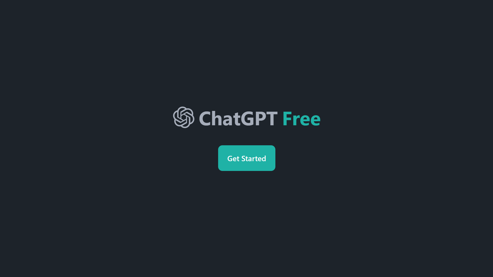
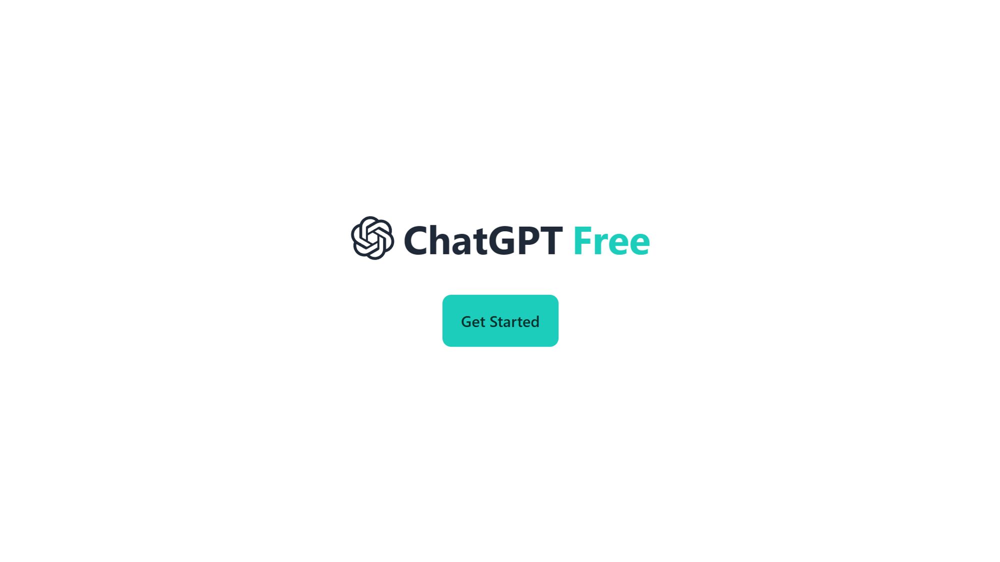
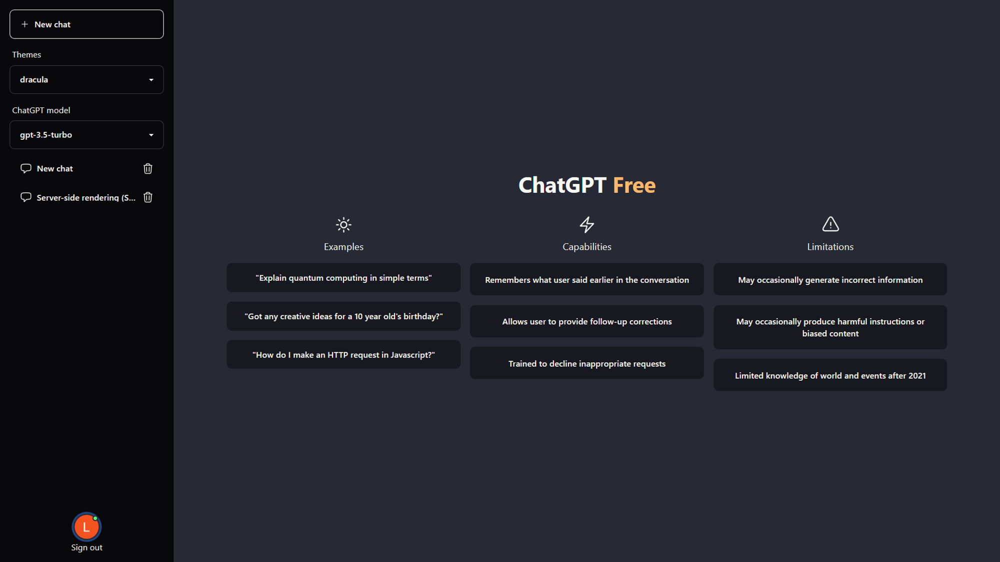
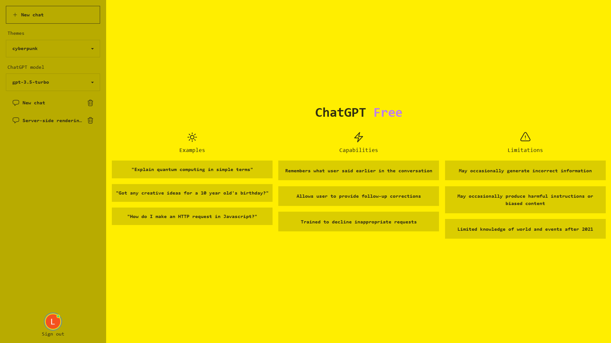
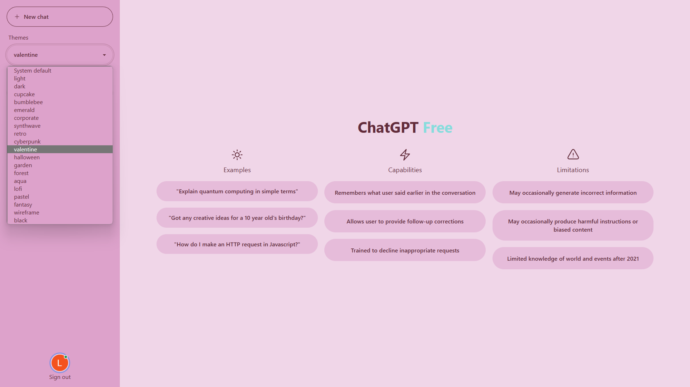
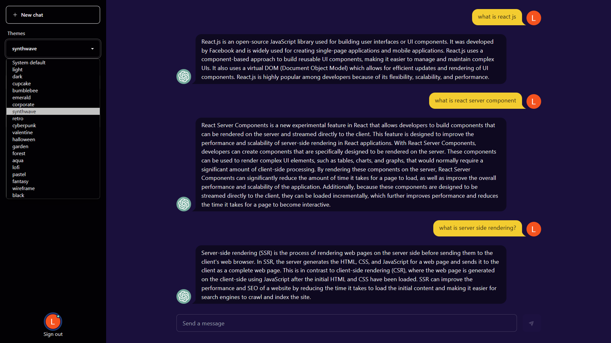
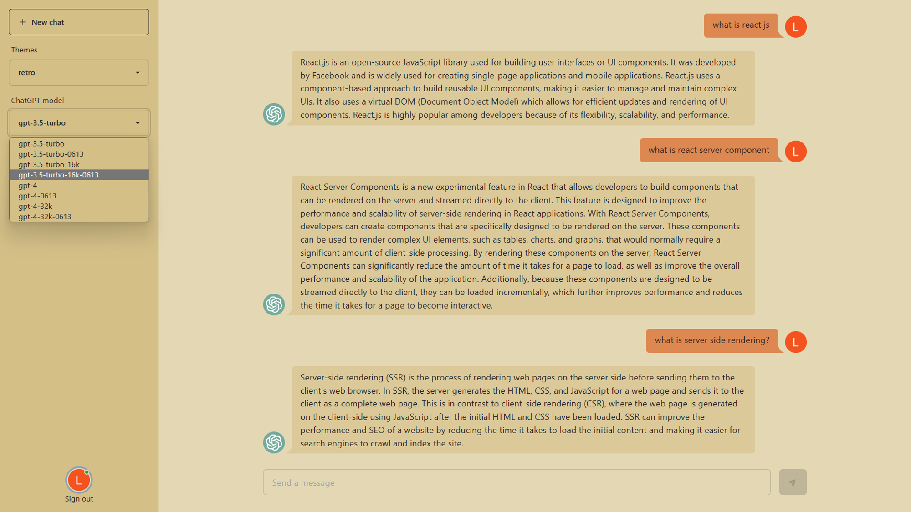
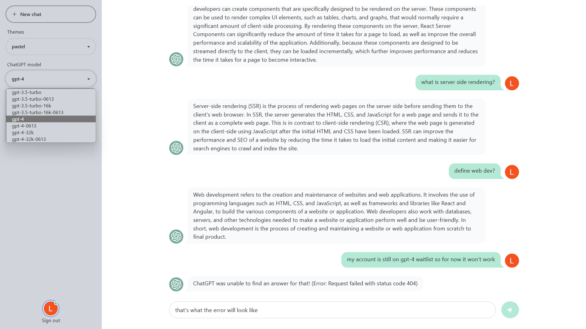
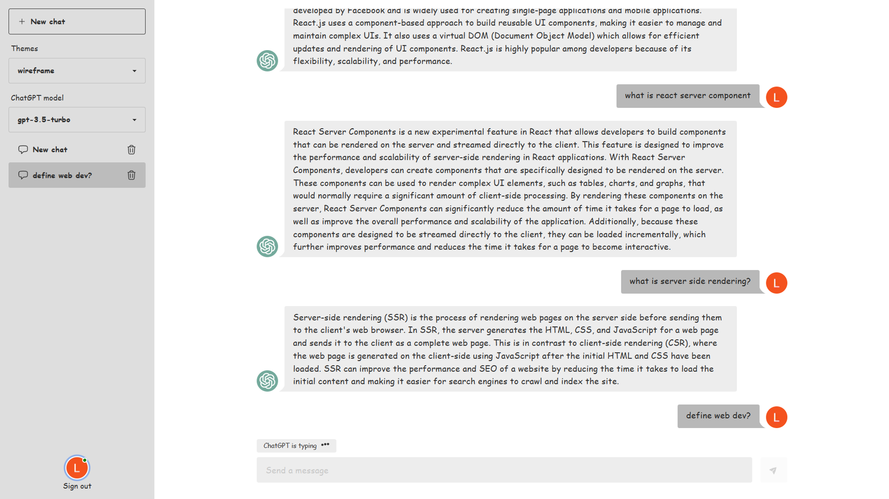

# ChatGPT Free

Full-stack ChatGPT web application.

## Features

- Full-stack serverless Next.js 13 application with App router and React Server Component.
- Authentication with NextAuth.js JWT and Google OAuth.
- NoSQL database with Google Firebase.
- OpenAI's GPT-3.5 and GPT-4 chat APIs.
- Multi themes with Tailwind CSS and DaisyUI.

## Previews

<figure>
  <figcaption>Login page, default dark</figcaption>
  
</figure>

<figure>
  <figcaption>Login page, default light</figcaption>
  
</figure>

<figure>
  <figcaption>Home page, dracula</figcaption>
  
</figure>

<figure>
  <figcaption>Home page, cyberpunk</figcaption>
  
</figure>

<figure>
  <figcaption>Home page, theme selection menu, valentine</figcaption>
  
</figure>

<figure>
  <figcaption>Chat page, theme selection menu, synthwave</figcaption>
  
</figure>

<figure>
  <figcaption>Chat page, AI model selection menu, retro</figcaption>
  
</figure>

<figure>
  <figcaption>Chat page, typing indicator, wireframe</figcaption>
  
</figure>

<figure>
  <figcaption>Chat page, error message, pastel</figcaption>
  
</figure>
